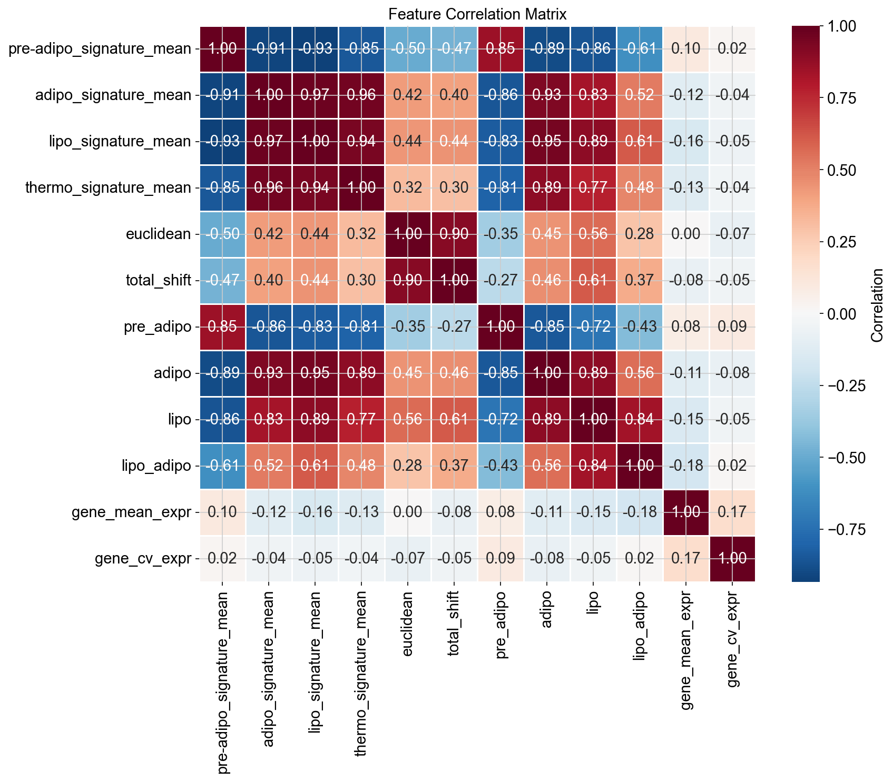
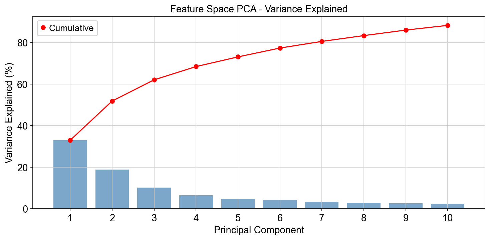

# Gene Regulatory Features Analysis

## Overview

This notebook builds **biologically-informed feature representations** for perturbation targets using the curated signature genes from `signature_genes.csv`. The features capture gene regulatory relationships and program-specific characteristics that will be used in prediction models.

## Dataset

- **Source**: `obesity_challenge_1.h5ad` (44,846 cells × 11,046 genes)
- **Signature Genes**: 888 curated markers from `signature_genes.csv`
- **Pre-computed Centroids**: `perturbation_centroids.csv` (123 perturbations × 2,000 HVGs)
- **Prediction Targets**: 10,238 genes from `genes_to_predict.txt`

## Signature Gene Distribution

| Program | Genes | Found in Data | Coverage |
|---------|-------|---------------|----------|
| pre-adipo | 50 | 49 | 98% |
| adipo | 50 | 48 | 96% |
| lipo | 472 | 393 | 83% |
| thermo | 316 | 307 | 97% |
| **Total** | **888** | **797** | **90%** |

## Feature Engineering

### Training Features (123 perturbations × 43 features)

#### 1. Signature Score Features (16 features)
Per-program signature activity computed from normalized expression:

| Feature | Description |
|---------|-------------|
| `{program}_signature_mean` | Mean signature gene expression |
| `{program}_signature_std` | Standard deviation of signature expression |
| `{program}_signature_median` | Median signature expression |
| `{program}_signature_n_genes` | Number of signature genes available |

Programs: pre-adipo, adipo, lipo, thermo

#### 2. Gene-Level Features (9 features)
Intrinsic properties of the perturbed gene:

| Feature | Description |
|---------|-------------|
| `is_signature_gene` | Binary: gene is in any signature |
| `is_pre-adipo_gene` | Binary: gene is pre-adipo marker |
| `is_adipo_gene` | Binary: gene is adipo marker |
| `is_lipo_gene` | Binary: gene is lipo marker |
| `is_thermo_gene` | Binary: gene is thermo marker |
| `gene_mean_expr` | Mean expression across all cells |
| `gene_std_expr` | Expression standard deviation |
| `gene_cv_expr` | Coefficient of variation |
| `gene_fraction_expressed` | Fraction of cells with expression > 0 |

#### 3. Co-expression Features (8 features)
Correlation with program signature genes:

| Feature | Description |
|---------|-------------|
| `{program}_max_corr` | Maximum Spearman correlation with program genes |
| `{program}_mean_corr` | Mean Spearman correlation with program genes |

#### 4. Perturbation Effect Features (10 features)
Quantified perturbation effects from clustering analysis:

| Feature | Description |
|---------|-------------|
| `euclidean` | Euclidean distance from control centroid |
| `cosine` | Cosine similarity to control centroid |
| `cell_count` | Number of cells with this perturbation |
| `pre_adipo`, `adipo`, `lipo`, `lipo_adipo` | Program proportion shifts |
| `total_shift` | Total absolute program proportion change |
| `cluster` | Perturbation cluster assignment (0-4) |

### Prediction Features (10,238 genes × 13 features)

Memory-optimized centroid-based features for all prediction target genes:

| Feature Category | Features |
|-----------------|----------|
| Signature membership | 5 binary indicators (is_signature, is_program for each) |
| Expression statistics | 4 metrics (mean, std, cv, max from centroids) |
| Program correlations | 4 Spearman correlations with program signatures |

**Coverage**: 1,999 genes (19.5%) in HVG centroids with full features; 8,239 genes with signature membership only.

## Key Findings

### Feature Correlations



**Strong positive correlations observed:**
- Signature scores across programs (ρ > 0.9) - indicating coordinated activation
- Adipo, lipo, thermo signatures are highly correlated
- Euclidean and total_shift measures are correlated (ρ = 0.90)

**Negative correlations:**
- Pre-adipo signature negatively correlates with mature programs (ρ ≈ -0.85)
- Pre-adipo program proportion inversely relates to adipogenic signatures

### PCA Analysis



**Variance explained by principal components:**

| PC | Individual % | Cumulative % |
|----|-------------|--------------|
| PC1 | 32.93% | 32.93% |
| PC2 | 18.86% | 51.79% |
| PC3 | 10.21% | 62.00% |
| PC4 | 6.38% | 68.38% |
| PC5 | 4.66% | 73.04% |
| PC1-10 | - | **88.22%** |

**Interpretation**: 3 PCs capture ~62% of variance, suggesting underlying biological structure with clear differentiation axes.

### Feature Statistics Summary

| Statistic | Numeric Features Mean |
|-----------|----------------------|
| Mean | Variable (0 to 11,046) |
| Std | Variable by feature type |
| Non-zero % | High for most features |

## Output Files

| File | Shape | Description |
|------|-------|-------------|
| `training_gene_features.csv` | 123 × 43 | Features for observed perturbations |
| `prediction_gene_features.csv` | 10,238 × 13 | Features for prediction targets |
| `feature_names.txt` | 43 lines | List of training feature names |

## Visualizations

### Generated Figures

1. **[Feature Correlation Matrix](figures/feature_correlation_matrix.png)**
   - Heatmap showing Spearman correlations between key features
   - Reveals coordinated program activation patterns

2. **[Feature PCA Variance](figures/feature_pca_variance.png)**
   - Scree plot showing variance explained by each PC
   - Cumulative variance curve demonstrating dimensionality

## Technical Notes

### Memory Optimization

The analysis uses **centroid-based computation** to avoid memory errors:
- Original approach: Load 44,846 × 10,238 dense matrix (3.42 GiB) → MemoryError
- Optimized approach: Use pre-computed 123 × 2,000 centroid matrix (~1.9 MB)
- Trade-off: 80.5% of prediction genes have partial features (signature membership only)

### Computational Efficiency

| Operation | Time | Memory |
|-----------|------|--------|
| Signature scoring | ~1s | Minimal |
| Co-expression (centroids) | ~5s | ~50 MB |
| Prediction features | ~14s | ~100 MB |

## Usage

### Loading Training Features

```python
import pandas as pd

# Load training features
train_features = pd.read_csv('training_gene_features.csv', index_col=0)
print(f"Training: {train_features.shape}")

# Load prediction features  
pred_features = pd.read_csv('prediction_gene_features.csv', index_col=0)
print(f"Prediction: {pred_features.shape}")
```

### Feature Subset Selection

```python
# Signature features only
sig_cols = [c for c in train_features.columns if 'signature' in c]

# Effect features only
effect_cols = ['euclidean', 'cosine', 'total_shift', 'cell_count']

# Program correlations
corr_cols = [c for c in train_features.columns if 'corr' in c]
```

## Biological Interpretation

### Feature Categories

1. **Signature Scores**: Capture the overall transcriptional state of cells with each perturbation
2. **Gene Properties**: Indicate whether perturbed genes are known program markers
3. **Co-expression**: Reveal regulatory relationships between perturbation targets and programs
4. **Effect Metrics**: Quantify the magnitude and direction of perturbation effects

### Model Preparation

These features are designed to:
- Predict perturbation effects for unobserved genes
- Identify genes likely to affect specific adipogenic programs
- Enable transfer learning from observed to unobserved perturbations

## Dependencies

```python
pandas>=1.5.0
numpy>=1.23.0
scanpy>=1.9.0
scipy>=1.10.0
scikit-learn>=1.2.0
matplotlib>=3.7.0
seaborn>=0.12.0
```

## Next Steps

1. **Feature Selection**: Identify most predictive features for modeling
2. **Model Training**: Use training features to predict program effects
3. **Validation**: Test on held-out perturbations
4. **Prediction**: Generate predictions for all 10,238 target genes
