# Deciphering Adipogenesis: scRNA-seq Perturbation Profiling 🧬

> **Can we predict how deleting a single gene rewrites a cell's destiny?**
> 
> This repository contains the complete analytical pipeline, biological interpretations, and "ground truth" characterization for the Broad Institute Obesity Challenge.

---

## 📋 Executive Summary

Obesity affects over 890 million adults globally. Unlocking the genetic drivers of adipocyte differentiation is critical for developing new metabolic therapies. This project analyzes a large-scale CROP-seq dataset (**44,846 cells, 123 gene perturbations**) to map the regulatory architecture of adipogenesis.

Before training predictive machine learning models, this analysis establishes the biological **"Ground Truth"** by quantifying exactly how specific gene knockouts shift cells between progenitor, adipogenic, lipogenic, and thermogenic states.

---

## 🔄 Analytical Workflow

The following diagram summarizes the four-stage pipeline implemented in this repository, moving from raw data to mechanistic insight and predictive features.

```mermaid
graph TD
    %% --- Sophisticated Bioinformatics Theme ---
    %%{init: {
        'theme': 'base',
        'themeVariables': {
            'primaryColor': '#ffffff',
            'primaryBorderColor': '#2c3e50',
            'primaryTextColor': '#2c3e50',
            'lineColor': '#34495e',
            'tertiaryColor': '#ecf0f1'
        }
    }}%%

    %% --- Node Styling ---
    classDef input fill:#2c3e50,stroke:#34495e,stroke-width:2px,color:#fff,rx:5,ry:5;
    classDef step fill:#fff,stroke:#7f8c8d,stroke-width:1px,color:#2c3e50,rx:2,ry:2;
    classDef highlight fill:#e8f8f5,stroke:#1abc9c,stroke-width:2px,color:#16a085;
    classDef critical fill:#fef9e7,stroke:#f1c40f,stroke-width:2px,color:#d35400,stroke-dasharray: 5 5;
    classDef output fill:#8e44ad,stroke:#8e44ad,stroke-width:2px,color:#fff,shape:rect;

    %% ==========================================
    %% TRACK 1: PRE-PROCESSING & SIGNAL (Top Row)
    %% ==========================================
    subgraph Track1 [<b>TRACK 1: Exploration & Signal Optimization</b>]
        direction LR
        
        Input([🧬 Raw CROP-seq<br/>44k Cells / 11k Genes]):::input
        
        subgraph P1 [Phase 1: QC & State Mapping]
            direction TB
            QC(QC & Filtering<br/>MT% / Depth):::step
            Norm(LogNorm &<br/>Scaling):::step
            States(Cell State ID<br/>Pre-Adipo/Adipo/Lipo/Thermo):::highlight
            
            QC --> Norm --> States
        end
        
        subgraph P2 [Phase 2: Signal Isolation]
            direction TB
            NC{NC Isolation<br/>8,705 Cells}:::critical
            Batch(Batch Effect<br/>Correction):::step
            HVG(Feature Selection<br/>Top 2,000 HVGs):::highlight
            
            NC --> Batch --> HVG
        end

        Input --> QC
        States --> NC
    end

    %% ==========================================
    %% TRACK 2: DYNAMICS & PREDICTION (Bottom Row)
    %% ==========================================
    subgraph Track2 [<b>TRACK 2: Perturbation Dynamics & Feature Engineering</b>]
        direction LR
        
        subgraph P3 [Phase 3: Perturbation Profiling]
            direction TB
            Centroids(Compute KO<br/>Centroids):::step
            Dist{Distance<br/>Metrics}:::critical
            Cluster(Functional<br/>Clustering):::highlight
            
            Centroids --> Dist --> Cluster
        end

        subgraph P4 [Phase 4: Feature Engineering]
            direction TB
            Sig(Signature<br/>Enrichment):::step
            Topo(Network<br/>Topology):::step
            Transfer(k-NN<br/>Transfer):::highlight
            
            Sig & Topo --> Transfer
        end

        FinalOut[["🚀 Predictive Features<br/>(122 Train / 2,863 Test)"]]:::output
        
        Cluster --> Sig
        Transfer --> FinalOut
    end

    %% ==========================================
    %% CONNECTOR (Wrapping the Lines)
    %% ==========================================
    HVG -.->|Expression Matrix| Centroids

    %% Link Styling
    linkStyle default stroke:#34495e,stroke-width:1.5px,fill:none;


```




---

## 📂 Repository Structure

```
Fatty-scRNAseq/
│
├── 1-Explore_training_data/
│   ├── explore_training_data.ipynb    # Baseline trajectory & QC
│   └── DATA_EXPLORATION_README.md     # Detailed exploration findings
│
├── 2- Batch_analysis/
│   ├── batch_analysis.ipynb           # HVG selection & control validation
│   ├── BATCH_ANALYSIS_README.md       # Batch effect assessment
│   └── highly_variable_genes.txt      # 2,000 selected HVGs
│
├── 3- Perturbation_analysis/
│   ├── perturbation_analysis.ipynb    # Centroid profiling & clustering
│   ├── PERTURBATION_ANALYSIS_README.md # Perturbation effect documentation
│   ├── perturbation_centroids.csv     # 123 perturbations × 2,000 HVGs
│   ├── perturbation_analysis_summary.csv # Effect sizes & program shifts
│   └── gene_perturbation_variance.csv # Variance contribution analysis
│
├── 4- Gene_regulatory_features/
│   ├── gene_regulatory_features.ipynb # Feature engineering pipeline
│   ├── GENE_FEATURES_README.md        # Feature methodology & validation
│   ├── training_gene_features_comprehensive.csv  # 122 genes × 42 features
│   ├── test_gene_features_comprehensive.csv      # 2,863 genes × 42 features
│   ├── training_gene_features.csv     # Alternative feature set
│   ├── prediction_gene_features.csv   # Prediction set features
│   └── feature_names.txt              # List of all feature names
│
├── Data/
│   ├── obesity_challenge_1.h5ad              # Input scRNA-seq dataset
│   ├── obesity_challenge_1_local_gtruth.h5ad # Ground truth for validation
│   ├── signature_genes.csv                   # 888 curated program markers
│   ├── genes_to_predict.txt                  # 2,863 test gene list
│   ├── predict_perturbations.txt             # Perturbation prediction targets
│   ├── program_proportion.csv                # Program proportion estimates
│   ├── program_proportion_local_gtruth.csv   # Ground truth proportions
│   ├── Challenge.txt                         # Challenge description
│   └── perturbed_mean_baseline_Quick_Starter.ipynb  # Quick start template
│
├── figures/                           # Generated visualizations
│   ├── feature_correlation_matrix.png        # Feature co-variation heatmap
│   ├── feature_pca_variance.png              # PCA variance explained
│   ├── perturbation_pca.png                  # Perturbation PCA projection
│   ├── perturbation_dendrogram.png           # Hierarchical clustering
│   ├── program_shift_heatmap.png             # Program proportion changes
│   ├── cluster_program_shifts.png            # Cluster-wise program effects
│   ├── perturbation_gene_heatmap.png         # Gene expression heatmap
│   ├── perturbation_distance_distribution.png # Distance metrics distribution
│   ├── batch_effect_nc_umap.png              # Batch effect visualization
│   ├── cell_states_nc_umap.png               # Cell state UMAP
│   ├── hvg_selection.png                     # HVG selection plot
│   └── ...                                   # Additional visualizations
│
├── Ressources/                        # Additional resources and documentation
│
└── README.md                          # This file
```

---

## 🔬 Key Analysis Phases

### 1. Exploratory Data Analysis (EDA)

**Objective:** Characterize the baseline differentiation landscape.

- **Data:** 44,846 cells × 11,046 genes, 123 perturbations
- **Finding:** Validated a clean separation of cell states, identifying the differentiation trajectory from **pre_adipo** (progenitors) to **adipo** (mature adipocytes), **lipo** (lipogenic/metabolic), and **thermo** (thermogenic/brown fat) cells.
- **Key Metrics:**
  - Mean UMI counts: 3,247 per cell
  - Mitochondrial content: 2.3% (low contamination)
  - 4 distinct cell programs with 888 signature genes

📊 **[See full exploration report →](1-Explore_training_data/DATA_EXPLORATION_README.md)**

---

### 2. Batch Correction & Feature Selection

**Objective:** Ensure biological signal dominates technical noise.

- **Method:** Isolated 8,705 Negative Control (NC) cells to check for batch artifacts across 8 samples.
- **Finding:** Controls showed high mixing and no severe batch effects (variance explained by batch: 8.3%).
- **Outcome:** Selected **2,000 Highly Variable Genes (HVGs)** based on dispersion to maximize signal-to-noise ratio for downstream modeling.
- **Validation:** HVGs enriched for known adipogenic markers (PPARG, CEBPA, FABP4) and metabolic pathways.

📊 **[See batch analysis report →](2-%20Batch_analysis/BATCH_ANALYSIS_README.md)**

---

### 3. Perturbation Effect Profiling

**Objective:** Quantify the "physics" of cell fate shifts.

- **Method:** Computed expression centroids for all 123 perturbations and calculated Euclidean/Cosine distances from the NC baseline.
- **Finding:** Identified a **"Checkpoint Model"** of differentiation:
  - **Differentiation Blockers** (e.g., CEBPA): Knockout traps cells in progenitor state
  - **Maturation Accelerators** (e.g., RNASEH2C): Knockout pushes cells into hyper-mature states
  - **Neutral Perturbations** (~30%): Minimal effect, suggesting system robustness

📊 **[See perturbation analysis report →](3-%20Perturbation_analysis/PERTURBATION_ANALYSIS_README.md)**

---

### 4. Gene Regulatory Feature Engineering

**Objective:** Build biologically-validated features to predict perturbation effects on unseen genes.

- **Method:** Comprehensive feature extraction across 5 categories:
  1. **Signature Enrichment:** Co-expression with program markers
  2. **Expression Profiles:** Program-specific statistics & differentiation ratios
  3. **Network Topology:** Degree centrality, clustering coefficient, neighbor enrichment
  4. **Perturbation Effects:** Direct measurements (training) + k-NN transfer (test)
  5. **Gene Membership:** Binary indicators for signature programs

- **Validation Framework:**
  - ✓ Known markers show expected enrichment (PPARG adipo: 0.357, CEBPA adipo: 0.506)
  - ✓ Gene family coherence (CEBP family CV: 0.13)
  - ✓ Biological hypothesis testing (PPARG diff ratio: 1.34 ✓ upregulated)
  - ⚠️ Discovery: Hierarchical program structure (lipo/thermo are adipo subsets)

- **Output:**
  - **Training set:** 122 genes × 42 features (measured perturbations)
  - **Test set:** 2,863 genes × 42 features (prediction targets)

📊 **[See feature engineering report →](4-%20Gene_regulatory_features/GENE_FEATURES_README.md)**

---

## 🚀 Major Discoveries

| Finding | Description | Implication |
|---------|-------------|-------------|
| **The RNASEH2C Paradox** | Knockout of this DNA repair gene caused an 84% increase in adipocyte differentiation | Suggests genomic stress may force cell cycle exit and terminal differentiation |
| **Hierarchical Program Architecture** | Lipo and thermo programs show high co-expression with adipo markers (>0.5 correlation) | Lipogenesis and thermogenesis are not independent states but specialized adipocyte subtypes |
| **Neuronal Gene Variance** | High variability in neuronal genes (e.g., GRIK2) across perturbations | Highlights underappreciated neuro-metabolic crosstalk in adipocytes |
| **System Robustness** | ~30% of perturbations (mostly ZNFs) had minimal effect | Adipogenesis is highly buffered against single-gene failures—network redundancy |
| **PPARG Master Regulation** | Knockout causes -0.48 adipo shift, highest of all TFs | Confirms PPARG as non-redundant master regulator |
| **Network Hubs** | Signature genes have 2.3× higher neighbor enrichment than non-signature genes | Core regulatory genes form highly interconnected modules |

---

## 📊 Key Visualizations

All high-resolution figures are available in the `figures/` directory and within individual analysis notebooks.

### Example Outputs:

1. **Perturbation Map:** PCA of all 123 knockouts showing the primary differentiation axis
2. **Program Heatmap:** Matrix quantifying shifts in cell state proportions for top hits
3. **Cluster Dendrogram:** Functional grouping of genes into regulatory modules
4. **Feature Correlation Matrix:** Co-variation patterns among 42 engineered features
5. **Network Topology:** Degree centrality distribution for signature vs non-signature genes

---

## 🛠️ Getting Started

### Prerequisites

- **Python 3.11+**
- Required packages:
  - `scanpy >= 1.11.5`
  - `pandas >= 2.3.3`
  - `numpy >= 2.3.5`
  - `scipy >= 1.17.0`
  - `scikit-learn >= 1.8.0`
  - `matplotlib >= 3.10.8`
  - `seaborn >= 0.13.2`

### Installation

```bash
git clone https://github.com/yourusername/Fatty-scRNAseq.git
cd Fatty-scRNAseq
python -m venv .venv
source .venv/bin/activate  # On Windows: .venv\Scripts\activate
pip install -r requirements.txt
```

### Usage

Run the notebooks in sequential order to reproduce the analysis:

1. **[1-Explore_training_data/explore_training_data.ipynb](1-Explore_training_data/explore_training_data.ipynb)** - Data QC and trajectory mapping
2. **[2- Batch_analysis/batch_analysis.ipynb](2-%20Batch_analysis/batch_analysis.ipynb)** - Feature selection and batch validation
3. **[3- Perturbation_analysis/perturbation_analysis.ipynb](3-%20Perturbation_analysis/perturbation_analysis.ipynb)** - Perturbation effect quantification
4. **[4- Gene_regulatory_features/gene_regulatory_features.ipynb](4-%20Gene_regulatory_features/gene_regulatory_features.ipynb)** - Feature engineering with biological validation

Each notebook is self-contained with detailed markdown explanations and validation checkpoints.

---

## 🎯 Biological Validation Checkpoints

This analysis emphasizes **biological rigor** at every step:

### ✓ Known Biology Validation
- PPARG shows highest adipo enrichment (0.357) ✓
- CEBPA family shows coherent enrichment (CV < 0.5) ✓
- UCP1 enriched in thermo program ✓
- Differentiation ratios validate trajectory (PPARG: 1.34, PDGFRA: 0.71) ✓

### ✓ Statistical Validation
- Gene family coherence testing
- Feature-effect correlation testing
- Train-test distribution alignment
- Hypothesis-driven marker validation

### ⚠️ Novel Findings Requiring Follow-up
- Lipo/thermo markers show unexpected adipo enrichment → suggests hierarchical not parallel programs
- Some canonical markers misassigned in original signatures → co-expression corrects this

---

## 📈 Next Steps: Predictive Modeling

With comprehensive features extracted, the next phase involves:

1. **Model Training:** Train regression/classification models to predict perturbation effects
2. **Transfer Learning:** Leverage 122 measured genes to predict 2,863 unseen genes
3. **Ensemble Methods:** Combine multiple feature sets (enrichment + network + expression)
4. **Validation:** Test predictions against held-out ground truth data
5. **Biological Interpretation:** Identify which features drive predictions (SHAP values)

**Feature matrix ready for ML:**
- Training: [4- Gene_regulatory_features/training_gene_features_comprehensive.csv](4-%20Gene_regulatory_features/training_gene_features_comprehensive.csv) (122 × 42)
- Test: [4- Gene_regulatory_features/test_gene_features_comprehensive.csv](4-%20Gene_regulatory_features/test_gene_features_comprehensive.csv) (2,863 × 42)

---

## 🤝 Acknowledgments & Context

This analysis was conducted as part of the **Broad Obesity 1 Challenge** hosted by **CrunchDAO**.

The data was provided by:
- **Eric and Wendy Schmidt Center** at the Broad Institute
- **Broad Diabetes Initiative**
- **Massachusetts General Hospital**

Special thanks to the challenge organizers for providing this rich dataset and the opportunity to contribute to obesity research.

---

## 📚 References & Citations

Key literature supporting this analysis:

1. **Adipogenesis Biology:**
   - Rosen & Spiegelman (2014). "What we talk about when we talk about fat." *Cell*
   - Cristancho & Lazar (2011). "Forming functional fat." *Nature Reviews Molecular Cell Biology*

2. **scRNA-seq Methods:**
   - Wolf et al. (2018). "SCANPY: large-scale single-cell gene expression data analysis." *Genome Biology*
   - Stuart & Satija (2019). "Integrative single-cell analysis." *Nature Reviews Genetics*

3. **CROP-seq Technology:**
   - Datlinger et al. (2017). "Pooled CRISPR screening with single-cell transcriptome readout." *Nature Methods*

4. **Obesity Statistics:**
   - WHO Obesity and Overweight Factsheet (2024)

---

## 📝 Author & License

**Author:** Haythem Mami  
**Date:** January 2026  
**License:** MIT

For questions or collaboration inquiries, please open an issue or contact via GitHub.

---

**⭐ If you find this analysis useful, please consider starring the repository!**


